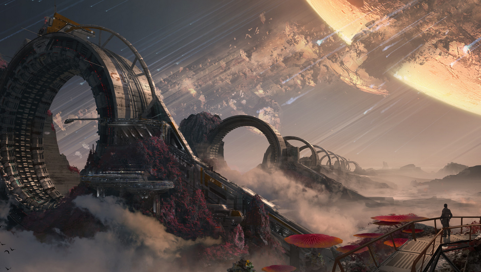

# IMPORTANT: This is Mod needs to be installed manually!!!

## Installation
Backup and install main menu background
1.  Download `menu_act01.bik` from [Mega](https://mega.nz/file/vU1TxIzR#wcs7JEhk8qHUp54tJBVsBWf-RDK8mdvNSKDRLmHcB1E) (original download link in [comment](https://www.reddit.com/r/titanfall/comments/gy0sjy/comment/ft8hwmf/?utm_source=share&utm_medium=web2x&context=3) of post).
2.  Make a copy of `Titanfall2\r2\media\menu_act01.bik` and name it `menu_act01_backup.bik`
3.  Copy and  Paste the file `menu_act01.bik` into `Titanfall2\r2\media\`
4.  Profit

## Upps i didnt make a backup (2 Options)
* Restore the game files via your game launcher.
* Download `menu_act01_backup.bik` from [Mega](https://mega.nz/file/yMEAlJzQ#0rgUq31hDG7SHnwnJWOAy4eSkOFiJO4apJVFeQx3dxY).

## Credit / Source:
Posted on Reddit by [u/AmJtheFirst](https://www.reddit.com/user/AmJtheFirst/) in [Post](https://www.reddit.com/r/titanfall/comments/gy0sjy/custom_main_menu_background_for_pc_dl_link_and/).

Research and instructions were made by [u/taskinoz](https://www.reddit.com/user/taskinoz) with help of [u/W4NT9DRE4M](https://www.reddit.com/user/W4NT9DRE4M)

Concept arts, used for this video, were created by [Tu Bui](https://www.artstation.com/2buiart), Concept and Matte Artist @ Respawn Entertainment

## How to create custom backgrounds
Follow the guide on the [Titanfall 2 Modding Guide by NoSkill](https://noskill.gitbook.io/titanfall2/) Page. 

Guide Link: https://noskill.gitbook.io/titanfall2/Modding/user-interface/menus/menu-background
